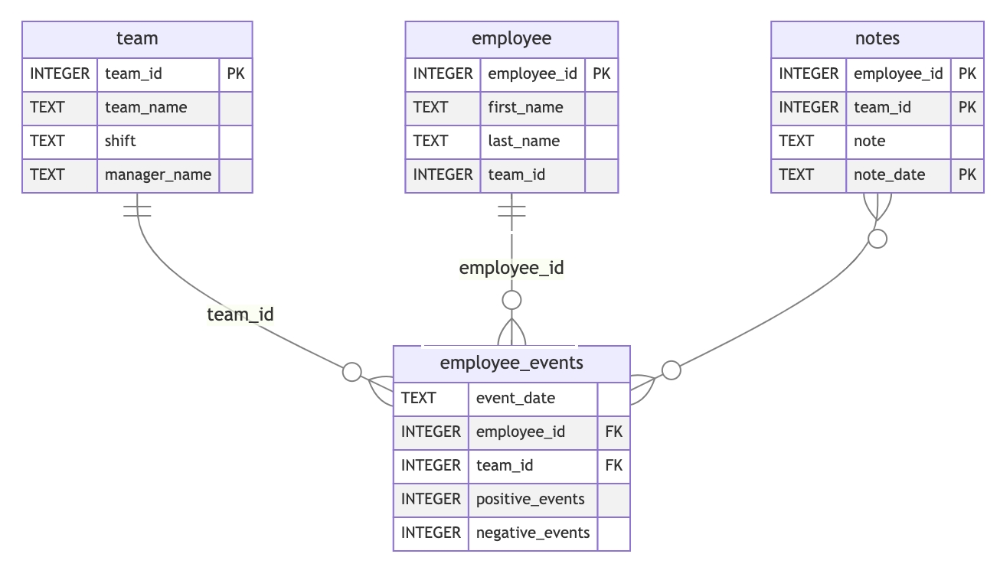

# Employee turnover dashboard

This repository was developed for use in Udacity's **Software Engineering for Data Scientists** final project.

### Objective
To create dashboard visualization that allows users to view the predicted probability of a turnover for a team, or individual employee.

### Repository Components overview
- `assets`: Folder comprising a classifier object that predicts turnover probability.
- `python-package`: 
  - A folder composed of scripts used to setup and execute SQL queries against employee database, `employee_events.db`. 
  - Data entity relationship diagram is displayed below. 
  - To enhance portability, a `setup.py` is provided to create a custom package, `employee_events`.
- `report`:
  - A folder for creating dashboard using FastHTML.
  - Interacts with `employee_events.db` to generate visualizations of teams and employees.
- `requirements.txt` lists packages and versions required.
- `tests`:
  - A `.py` file for running unit tests using `pytest`.

### Repository Structure
```
├── README.md
├── assets
│   ├── model.pkl
│   └── report.css
├── env
├── python-package
│   ├── employee_events
│   │   ├── __init__.py
│   │   ├── employee.py
│   │   ├── employee_events.db
│   │   ├── query_base.py
│   │   ├── sql_execution.py
│   │   └── team.py
│   ├── requirements.txt
│   ├── setup.py
├── report
│   ├── base_components
│   │   ├── __init__.py
│   │   ├── base_component.py
│   │   ├── data_table.py
│   │   ├── dropdown.py
│   │   ├── matplotlib_viz.py
│   │   └── radio.py
│   ├── combined_components
│   │   ├── __init__.py
│   │   ├── combined_component.py
│   │   └── form_group.py
│   ├── dashboard.py
│   └── utils.py
├── requirements.txt
├── start
├── tests
    └── test_employee_events.py
```

### ER diagram for `employee_events`:
Provided under _4.4 Project Instructions_ page.


### Getting started
- Provision `employee_events` package by:
  - Creating a distribution
  ```
  cd ./python-package
  python setup.py sdist
  ```

  - Run the installation 
  ```
  pip install dist/employee_events-0.0.tar.gz
  ``` 

  - Check by activating `ipython`:
  ```python
  import employee_events
  ```

- To access the dashboard, 
  - `cd` to access `report` folder
  - Run:
  ```
  python dashboard.py
  ```

### References
- This repository was developed from this [source](https://github.com/udacity/dsnd-dashboard-project).
- Sources used for coding is referenced in the code comments, prefixed by `Ref: `.
